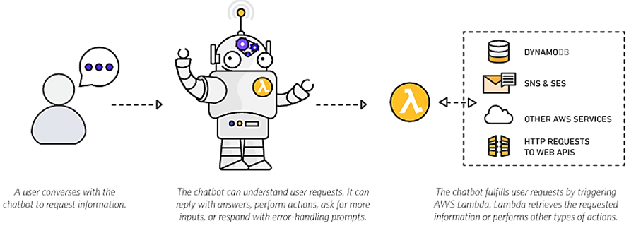
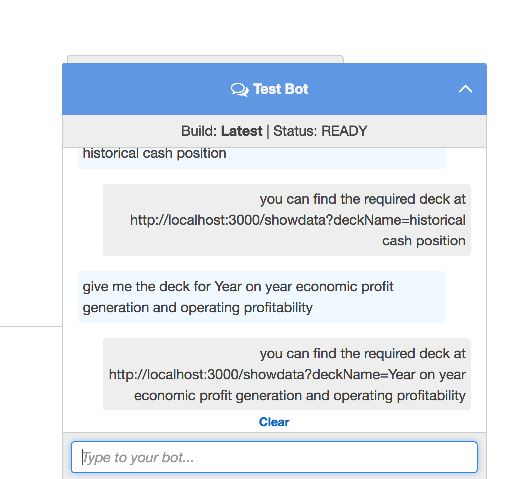
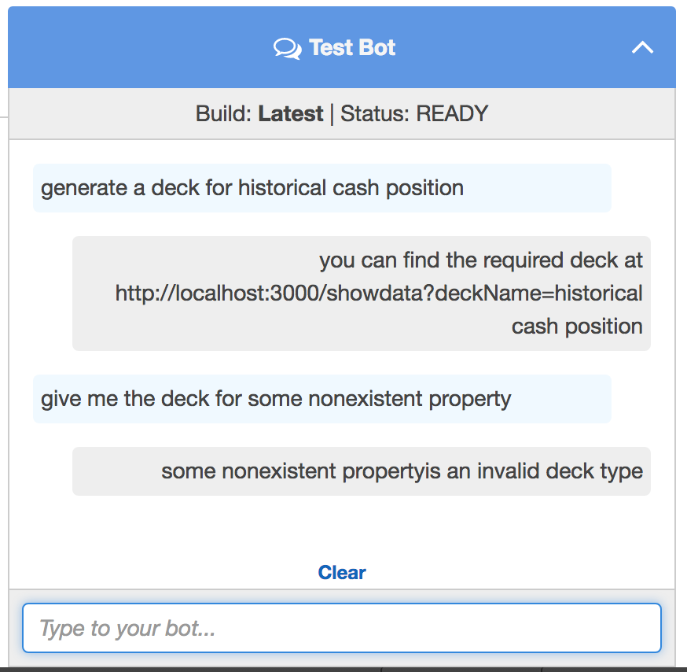
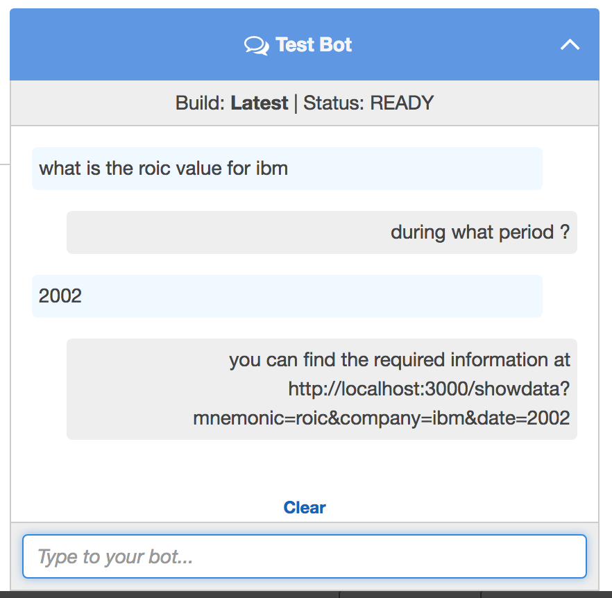
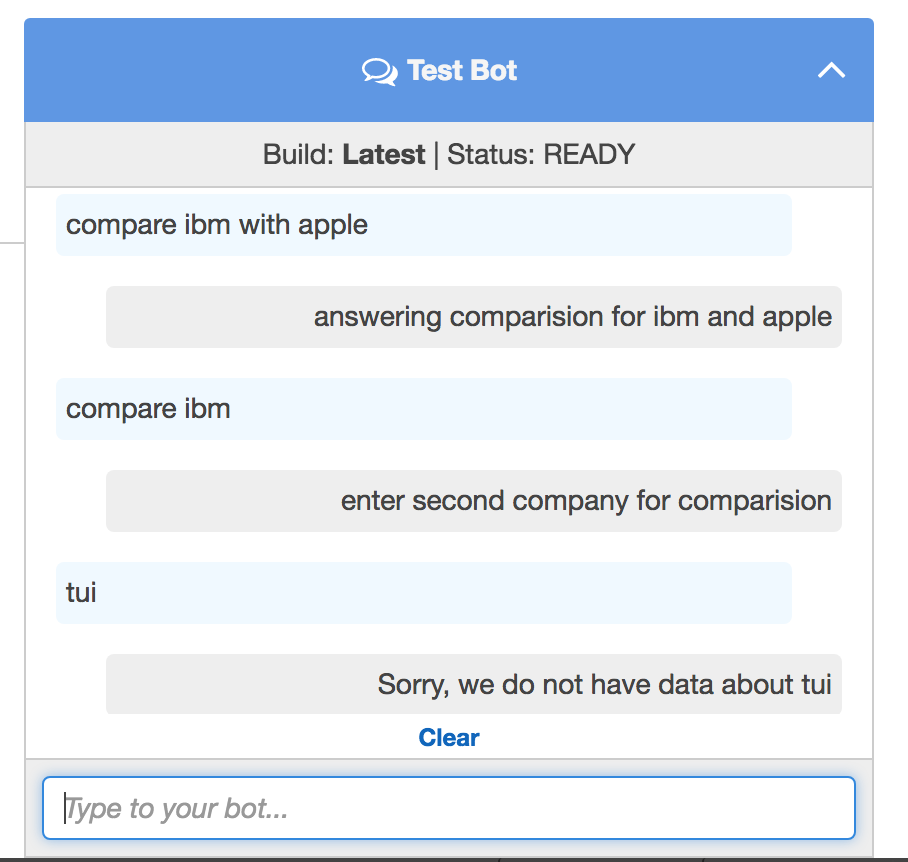

# CPAT-Helpdesk

## POC Objective 

The aim of the project was to build a conversational question answer based chatbot. The project is as of now a POC and is to primarily serve the following functions
* act as a general helpdesk to the users, where users can inquire about the capabilities of CPAt and find the correct section of the application for their query       
* act as an alternate more intuitive interface for the users to specify and customise their queries for the data they require
* The bot is also expected to maintain a conversation flow and further probe the user for any crucial information that he may have missed.

### Sample Conversations 
Q > what is the Return on investment value for IBM \
A > during what period \
Q > during 2002-2003 \
Q > you can find the required information at \<LINK\> 

Q > compare IBM and Apple on historical cash position \
A > you can find the required information at \<LINK\>


## Proposed Solution 

The problem can solved by building an intent based chatbot Model specific to the required context.
This can be broken down into following parts

* **Understanding the question** - The bot would first need to extract the required information from the question posed by the user such as the intent of the question and the different entitites present in it. The intent is used to direct the bot to execute one of the predefined branches (also know as intents in AWS lex), while the different entities are the required for the fulfilment of the intent. This part is handled by AWS lex's inbuild NLU parser 

* **Validatiion of the entities** - The bot will then need to check for validity of the information provided by the user (entities) and also prompt for missing entities

* **Processing entities and responding back** - The bot will then need to process the entities in some manner and return a response to the user. For example for a given deck name and company as entities the bot can process the information and return the link to an API endpoint.

### Technologies used

**Amazon Lex** - Amazon Lex is a service for building conversational interfaces into any application using voice and text. Amazon Lex provides the advanced deep learning functionalities of automatic speech recognition (ASR) for converting speech to text, and natural language understanding (NLU) to recognize the intent of the text, to enable you to build applications with highly engaging user experiences and lifelike conversational interactions.

**AWS Lambda** - AWS Lambda lets you run code without provisioning or managing servers. Amazon lex can be combined with AWS lambda which can be used as code hook for validation and fulfillment through lex. 

### Methodologies 

Prior to using it, Amazon lex must be trained. The bot is trained by specifying a set of intents specific to the application. For each intent The following parameters are specified 
* a set of sample utterances which will trigger the intent
* a set of slots(entities) with their required prompt messages
* a confirmation prompt that is called before the fulfillment lambda function is invoked.
* the lambda functions (if to be used) required for validation and fulfillment 

 

* After the intents and their sample utterances are specified lex learns to categorize user questions into one of these intens. It can correctly recognize the intent of the sentence even if it does not exactly match any of the sample utterances for that intent

* It then proceeds to the 'initialization and valdiation' step. Out of the box Lex can determine which of the required entities are missing in the context and prompts the user for them. Any complex validation of the data (ex - verifying that the specified deck type is a valid one) have to be done by specifying a lambda function as a code hook.  

* For processing the entities and responding back the user needs to define a lambda function and specify it as the fulfillment code hook for the intent.




### Using Lambda functions with Lex

Lambda functions are functions that are invoked by lex passing an event, a context object and a callback to pass data to Lex. A lex event to lambda contains the fllowing fields
* the name of the intent
* the slot values for the different slots for the intents
* the invocationSource (whether the Lmabda is invoked for fulfillment or validation)

sample input 

```
{
  "currentIntent": {
    "slots": {
      "deck" : "hisytorical cash position"
    },
    "name": "getDeck",
    "confirmationStatus": "None"
  },
  "bot": {
    "alias": "$LATEST",
    "version": "$LATEST",
    "name": "OrderFlowers"
  },
  "userId": "John",
  "invocationSource": "DialogCodeHook",
  "outputDialogMode": "Text",
  "messageVersion": "1.0",
  "sessionAttributes": {}
},null, (err, data) => {
  console.log(data);
}
```

For more information on how to use lambda functions with lex see [here](http://docs.aws.amazon.com/lex/latest/dg/lambda-input-response-format.html)

`note - same lambda function can be used for both initialization and validation as awell as fulfillment`

## Working Screenshots






